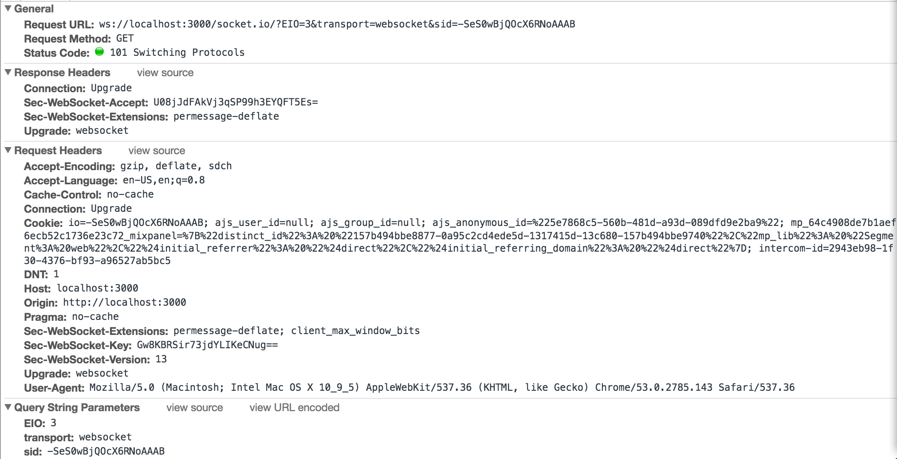

# Chat client with nodejs and websockets

## Tech Stack
- Node, npm
- express
- socket.io
- bunyan for logging

## Run Locally
- npm install
- node . 
  - optionally node . | bunyan
- Browse to http://localhost:3000

## WS Protocol Upgrade
